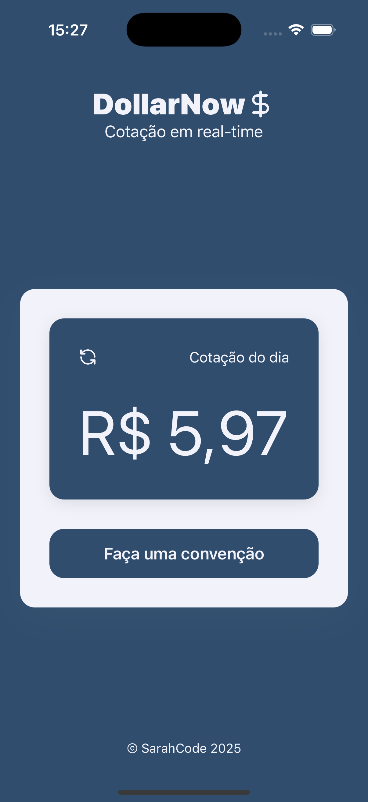
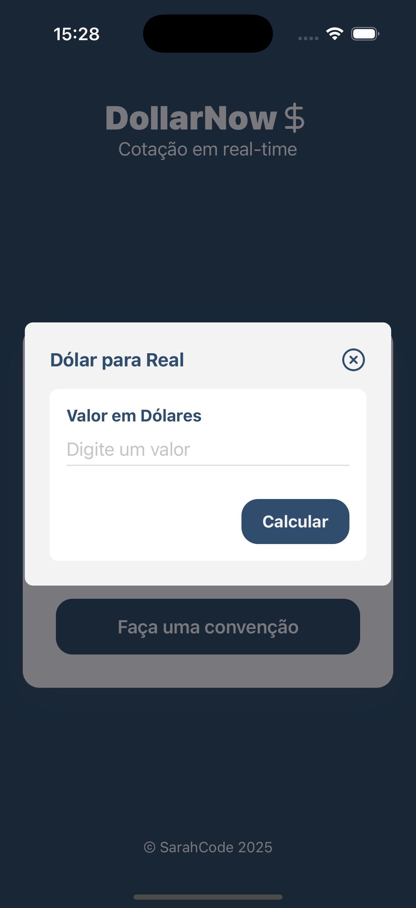
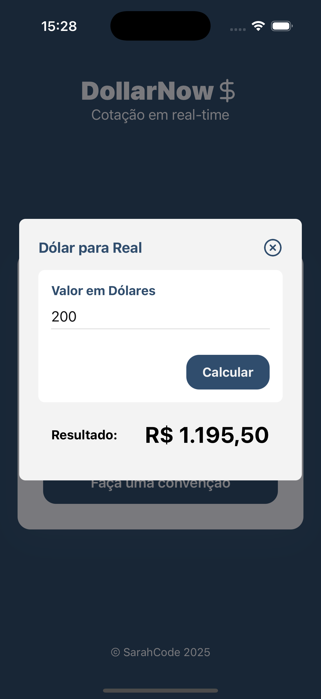

# DollarNow

DollarNow is a real-time dollar exchange rate application built with Expo, TypeScript, and React Native. The main screen displays the current exchange rate, and if you want to convert a specific amount from dollars to Brazilian Real (BRL), simply click the "Convert" button, which will open a modal where you can input the amount and see the result instantly.

## Screenshots

Here are some screenshots of the app in action:

### Main Screen



### Conversion Modal



### Result



## Features

- **Current exchange rate**: The main screen displays the real-time dollar to Brazilian Real exchange rate.
- **Conversion modal**: Easily input the dollar amount you want to convert by clicking the "Convert" button to open the modal.
- **Instant results**: The app will instantly show the converted value in Brazilian Real once you input the amount.

## How to Use

1. Upon opening the app, the current exchange rate for the day is displayed on the main screen.
2. To convert a specific amount, click the "Convert" button.
3. A modal will appear where you can enter the dollar amount you wish to convert.
4. After entering the value, the app will automatically show the equivalent amount in Brazilian Real.

## Installation

To run the app locally, follow these steps:

1. Clone the repository:

```bash
git clone https://github.com/yourusername/dollar-now.git
```

2.Navigate to the project directory:

```bash
cd dollar-now
```

3.Install the dependencies:

```bash
yarn
```

4. Run the application:

```bash
yarn start
```

Choice `i` to run iOS simulator or `a` to run Android simulator and the app should now be running locally on your Expo client or simulator.
